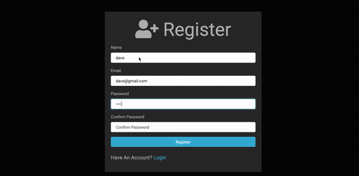

# 🔐 node-passport-auth ✅

Node.js authentication application using passport.js local strategy and mongoDB Atlas



## Usage

```bash
# Run dev server
$ npm run dev
```

## References

- [Passport.js](http://www.passportjs.org/docs/authenticate/)
- [Embedded JavaScript templating (EJS)](https://ejs.co/)
- [connect-flash npm](https://github.com/jaredhanson/connect-flash)
- [Node.js with passport authentication](https://www.youtube.com/watch?v=6FOq4cUdH8k)
